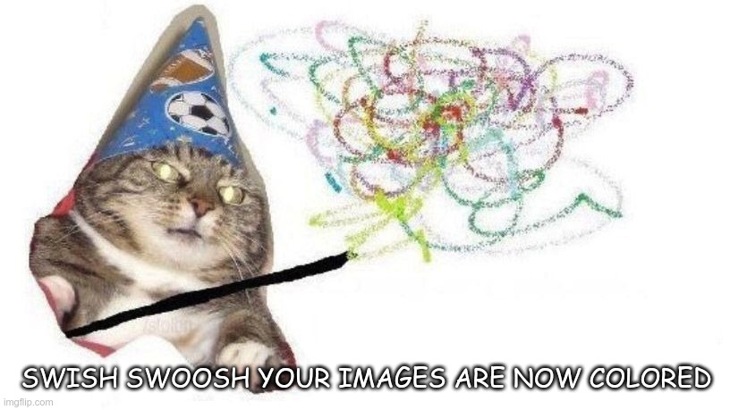

# KNN project - Image colorisation
## Intro
Project is based on original [DeOldify](https://github.com/dana-kelley/DeOldify) architecture.

**Authors:**
 - Tomáš Venkrbec ([xvenkr01](mailto:xvenkr01@stud.fit.vutbr.cz))
 - Fořtová Kateřina ([xforto00](mailto:xforto00@stud.fit.vutbr.cz))
 - Dvořák Jiří ([xdvora2u](mailto:xdvora2u@stud.fit.vutbr.cz))

## Results
Examples of colorized images are shown in `results` folder.

*Note: Project is currently under development and therefore these results only represent the current state of project, not the project in its final form.*

## Quickstart guide
 1. Pull this repository to local machine: `git pull https://github.com/TomasVenkrbec/knn-project`
 2. Run the install script: `chmod +x install.sh && . install.sh`
    * For quick access to python virtual environment, use `. path.sh` next time.
 3. Start the main script: `python3 run.py`
    * For list of available arguments, run the script with `-h` argument

## Requirements / Tested on
 - Python 3.8.5
 - Tensorflow 2.4.1
 - [ImageNet](http://image-net.org/) dataset (preferably downscaled 64x64 version)

z
